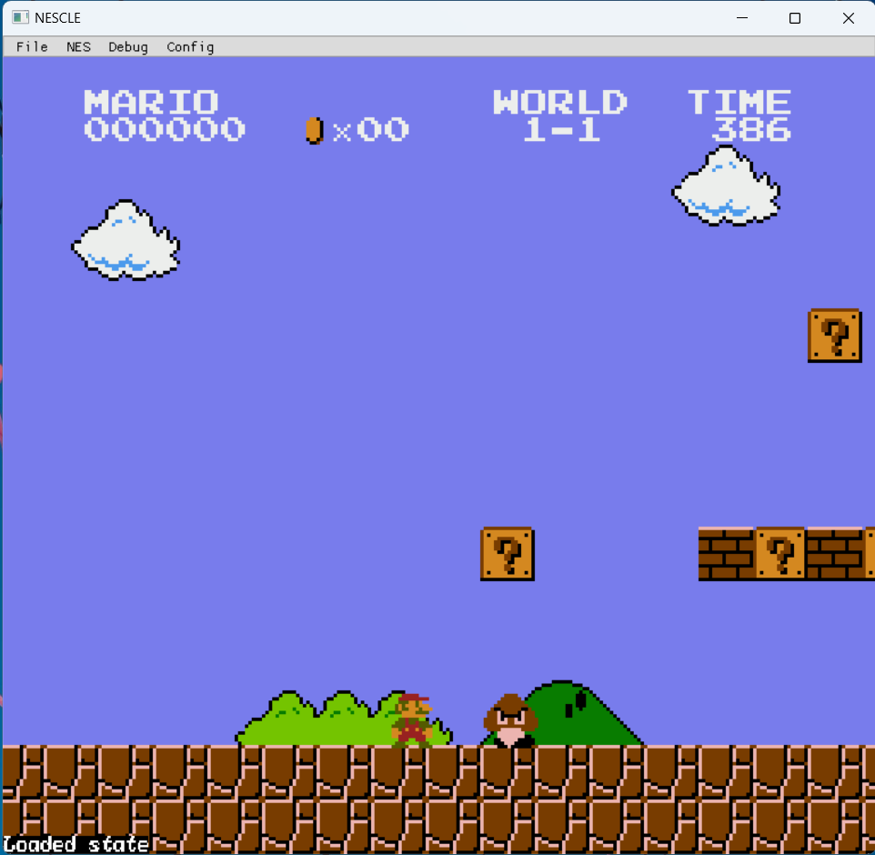

# NESCLE
## NESCLE in Action

## What is NESCLE?
NESCLE (pronounced like Nestlé) is a free and open-source NES (Nintendo Entertainment System) emulator written in the C programming language, with the front-end writen in C++. It uses SDL2 for audio and input, OpenGL 3.3+ for graphics, and Dear ImGui for the graphical user interface. NESCLE will eventually provide a
terminal user interface for users who prefer using the command line.

### Why C?
Most popular NES emulators are almost exclusively written in C++, and many newer, lesser used emulators are
written in Rust. Knowing little (modern) C++ and no Rust, but still requiring the high-performance of those languages,
I chose to rely on an old friend, C. This makes NESCLE unique among the existing NES emulators, as the code (mostly)
maintains the readability of C code compared to the often hard to parse C++ code.
I do not claim to be the only person to write a NES emulator in C,
but I do claim that popular forms of such emulators are rare.
As SDL and OpenGL are C libraries,
choosing to write the entire project in C++ would lead to even more clumsy integration between the C and C++ code than there already is.
Even the C++ code in NESCLE is mostly written like C code as much as possible. This is because C++, specifically modern C++, contains many

## Requirements and Dependencies
As of now, NESCLE has not been packaged for any operating system. This means that you have to compile it yourself from the source code.
To build the code you need a C compiler that supports the C11 and C++11
standards.

Requirements:
* CMake 3.15+
* A C/C++ compiler and build system that supports C11+ and C++11+
* A graphics card that supports OpenGL 3.3+
* A windowing system that is compatible with ImGui Multi-Viewports (aka not Wayland)

This software makes use of the following third-party libraries:
* SDL2 under the terms and conditions of the [zlib license](https://www.libsdl.org/license.php)
* Dear ImGui under the terms and conditions of the [MIT license](https://github.com/ocornut/imgui/blob/master/LICENSE.txt)
* Native File Dialog Extended under the terms and conditions of the [zlib license](https://github.com/btzy/nativefiledialog-extended/blob/master/LICENSE)
* Jansson under the terms and conditions of the [MIT license](https://github.com/akheron/jansson/blob/master/LICENSE)
* glad under the terms and conditions of its various [licences](https://github.com/Dav1dde/glad/blob/glad2/LICENSE)

# Installation
nstalling NESCLE is simple. The only tricky part is that
ou will need to manually install glad and nestest. Everything else will be
andled for you by CMake. But if you follow the following steps,
verything should be A-Okay
. Go to the following [link](https://glad.dav1d.de/#language=c&specification=gl&api=gl%3D3.3&api=gles1%3Dnone&api=gles2%3Dnone&api=glsc2%3Dnone&profile=core&loader=on)
. Scroll to the bottom and click generate
. Download and extract the zip file to the root directory of the project and make sure the directory you extract to is named "glad"
. Download and extract the nestest rom into a directory named `res`
. Create a build directory and cd into it
. Run `cmake ..`
. Run `cmake --build .`
. Copy SDL2.dll to the build directory from SDL2/lib/x64/SDL2.dll
. To run NESCLE, just type ./nescle

## Acknowledgements
I would like to provide a massive thank you to javidx9 (aka the One Lone Coder) for his excellent YouTube series
on NES emulation and to the SimpleNES repository for providing countless help and inspiration for my own emulator
implementation. By no means does this software copy verbatim from either of their implementations, nor any other
NES emulator implementation, this is simply an acknowledgement that those sources were used by me as inspiration.
The NESdev wiki also deserves a mention as a "one-stop shop" for finding out information about the NES.

## Contact Me
You can contact me at the email address <edward.pinkston@gmail.com>

## License
This software is licensed under the Apache 2.0 License. See [LICENSE.txt](LICENSE.txt) for more information.
